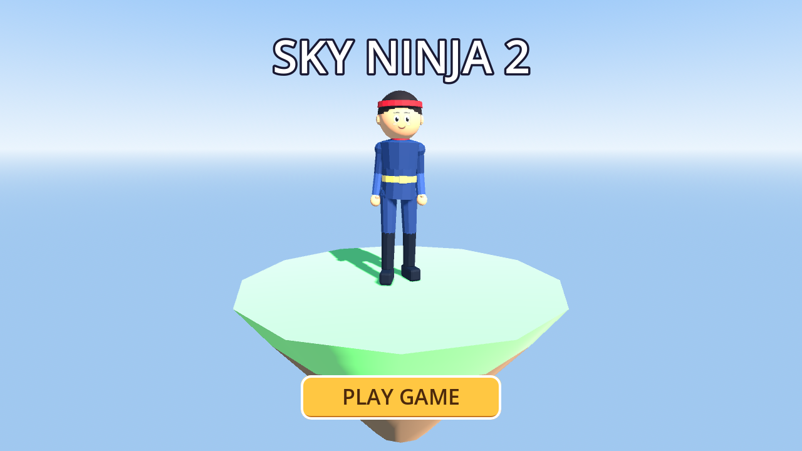
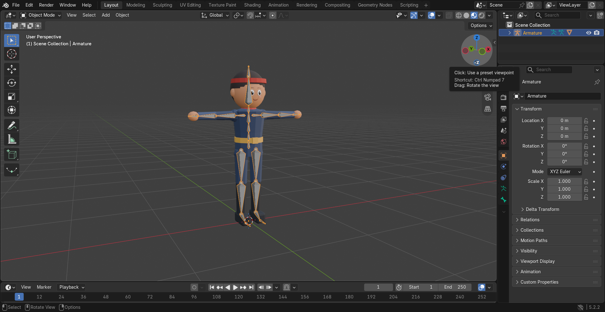
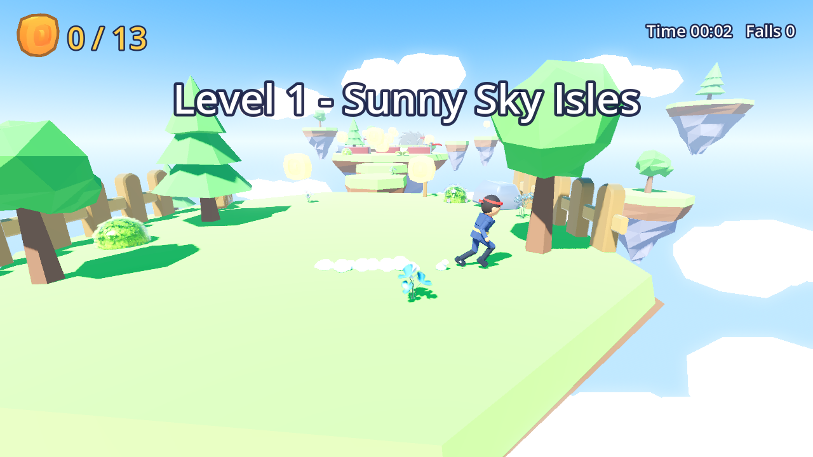
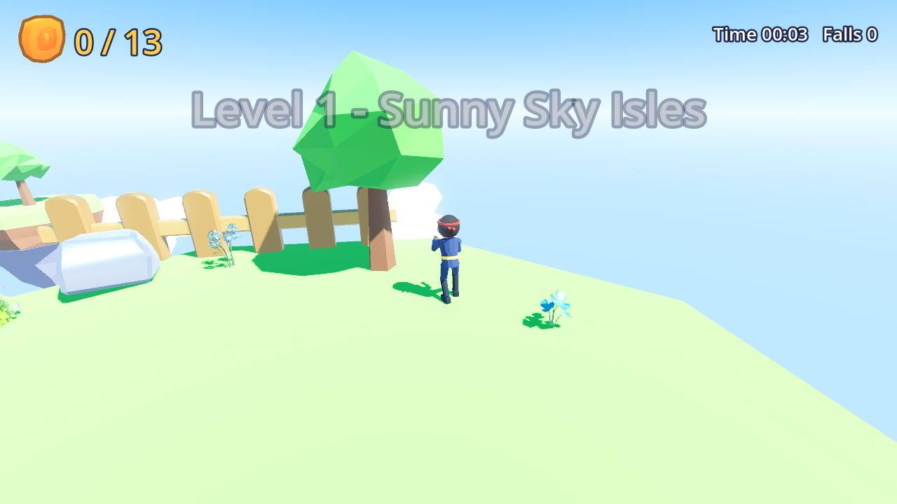
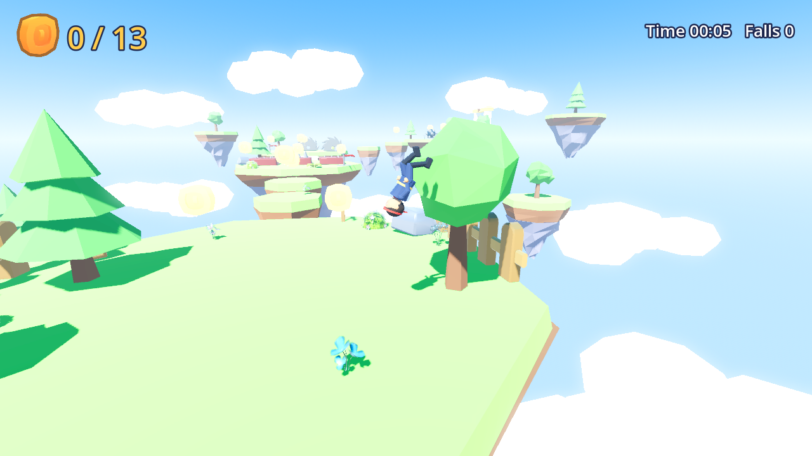
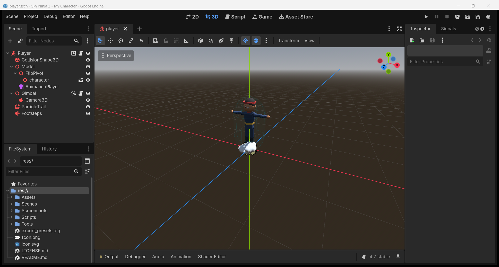

# Sky Ninja 2 – My Character 🥋☁️

แบบฝึกหัดที่ 6: **ออกแบบตัวละคร** — สร้างตัวละคร 3D ใน **Blender** ใส่โครงกระดูกแบบ **Mixamo**
แล้วนำเข้า **Godot 4.7** โดยใช้ท่าทางจาก [Godot4-OpenAnimationLibraries](https://github.com/catprisbrey/Godot4-OpenAnimationLibraries)
(`Mixamo BoneMap.tres`, `MeleeLib.res`, `ShooterLib.res`) จากนั้นนำตัวละครไปเป็น **Player** ในเกมของแบบฝึกหัดที่ 5 (Sky Ninja)
หน้าเริ่มเกมแสดงตัวละครพร้อมปุ่ม **PLAY GAME**



## วิธีเล่น

เกมเปิดที่หน้าแสดงตัวละคร (ลากเมาส์ = หมุนตัวละคร) กด **PLAY GAME** เพื่อเริ่มเล่น

| ปุ่ม | การทำงาน |
|---|---|
| `W A S D` | เดิน / วิ่ง |
| เมาส์ | หมุนกล้อง (คลิกในเกมเพื่อล็อกเมาส์) |
| `Space` | กระโดด — กดอีกครั้งกลางอากาศขณะเคลื่อนที่ = ตีลังกา |
| คลิกซ้าย / `F` | โจมตี: ต่อย → ต่อย → เตะ (กดต่อเนื่อง), กลางอากาศ = ฟันกระโดด |
| `Esc` / `P` | หยุดเกม (Resume / Restart Level / Main Menu) |

เก็บเหรียญให้ครบเพื่อเปิดประตู GOAL แล้วเข้าประตูเพื่อไปด่านต่อไป (2 ด่าน)

## ขั้นตอนการสร้างตัวละคร

### 1. Blender – สร้างโมเดล + โครงกระดูก
สคริปต์ [`Tools/blender/make_character.py`](Tools/blender/make_character.py) สร้างตัวละคร low-poly จาก primitive
(หัว ผม ผ้าคาดหัว ลำตัว แขน ขา รองเท้า) แล้วสร้าง Armature แบบ **Mixamo** (`mixamorig:Hips`, `mixamorig:Spine` …)
ในท่า T-pose และผูก mesh เข้ากับกระดูก (vertex group) จากนั้น export เป็น `Assets/Models/player6/character.glb`
(ไฟล์ต้นฉบับที่แก้ไขต่อได้: `Assets/Models/player6/character.blend`)

```
blender --background --factory-startup --python Tools/blender/make_character.py -- <project folder>
```



**ใบหน้า**: หน้าตัวละครเป็น mesh แยกที่แปะบนหัว ใช้ภาพ `Assets/Models/player6/face.png`
หากต้องการใช้ใบหน้าตัวเอง ให้แทนที่ไฟล์นี้ด้วยรูปหน้าตรง (สี่เหลี่ยมจัตุรัส พื้นหลังโปร่งใส) แล้วรันสคริปต์ใหม่

> **Mixamo**: โครงกระดูกใช้ชื่อกระดูกแบบเดียวกับ Mixamo ทุกประการ จึงใช้ `Mixamo BoneMap.tres` ได้ทันที —
> หากต้องการ auto-rig ผ่าน [mixamo.com](https://www.mixamo.com/) ก็ export `character.blend` เป็น FBX อัปโหลดขึ้น Mixamo
> แล้วดาวน์โหลดกลับมาแทน `character.glb` ได้เลย ขั้นตอนใน Godot เหมือนเดิม

### 2. Godot – Retarget ด้วย Mixamo BoneMap
ใน Advanced Import ของ `character.glb` → เลือก `Skeleton3D` → **Retarget → Bone Map** = `Assets/Animations/Mixamo BoneMap.tres`
Godot จะเปลี่ยนชื่อกระดูกเป็นมาตรฐาน Humanoid และเปลี่ยนชื่อ Skeleton เป็น `GeneralSkeleton`
ทำให้ท่าทางใน `MeleeLib.res` / `ShooterLib.res` (track `%GeneralSkeleton:Hips` …) เล่นกับตัวละครได้ทันที

### 3. Animation ของ Player
[`Tools/build_player6_animations.gd`](Tools/build_player6_animations.gd) สร้าง `player6_animations.res` โดยเลือกท่าจากไลบรารี
แล้วตั้งชื่อตามที่ `player.gd` ใช้

| ชื่อใน Player | ท่าจากไลบรารี |
|---|---|
| Idle / Walk / Run | Shooter `idle` / `walk` / `run_067` |
| Jump / Fall / Land | Shooter `jump` / `fall` / `fall-landing` |
| Flip | Shooter `jump` + หมุน `FlipPivot` 360° |
| Attack1 / 2 / 3 | Shooter `punchright` / `punchleft` / `kick1` |
| AirAttack | Melee `LightJumpAttack` |
| Hurt / Death | Shooter `hurt1` / `die1` |
| VictorySign | Shooter `handsup-idle` |

```
Godot_v4.7-stable_win64_console.exe --headless --path . -s Tools/build_player6_animations.gd
```

### 4. หน้าเริ่มเกม
`Scenes/UI/showcase.tscn` แสดงตัวละครบนเกาะลอยฟ้า (AnimationPlayer ใส่ไลบรารี `melee`, `shooter`, `player`) และปุ่ม PLAY GAME

## ภาพหน้าจอ

| | |
|---|---|
|  |  |
|  |  |

## ทดสอบอัตโนมัติ

```
Godot_v4.7-stable_win64_console.exe --headless --path . -s Tools/play_test.gd
```
ตรวจ 29 รายการ: เปิดที่หน้าเริ่มเกม, มีท่าจาก Melee/Shooter, Skeleton ถูก retarget, ท่า Idle ขยับกระดูกจริง, คอมโบโจมตี,
กระโดด/ตีลังกา, กับดัก, checkpoint, เหรียญ, ประตู, เปลี่ยนด่าน, หน้าจอชนะ

ภาพหน้าจอเกมสร้างด้วย `Godot --path . -s Tools/capture_screenshots.gd`

## Export เป็น Web / GitHub Pages
Project → Export → preset **Web** (Compatibility renderer, Thread Support = off) → คัดลอกไฟล์ใน `export/web/` ไปไว้ที่ `docs/`
แล้วตั้ง Settings → Pages → branch `main` โฟลเดอร์ `/docs`

## Credits
- ท่าทาง: [Godot4-OpenAnimationLibraries](https://github.com/catprisbrey/Godot4-OpenAnimationLibraries) โดย catprisbrey
- 3D Platformer Starter Kit — SD Studios / The Silver Demons (MIT)
- Ultimate Platformer Pack, Ultimate Stylized Nature Pack — [Quaternius](https://quaternius.com) via Poly Pizza (CC0)
- ตัวละคร: สร้างเองใน Blender (แบบฝึกหัดที่ 6)
